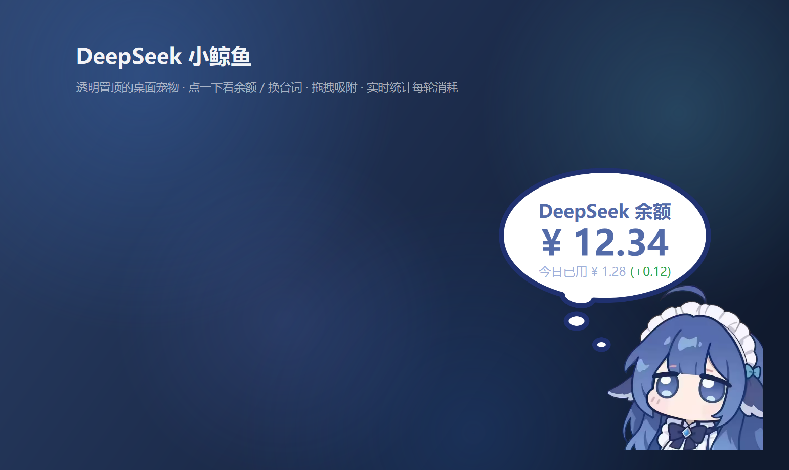
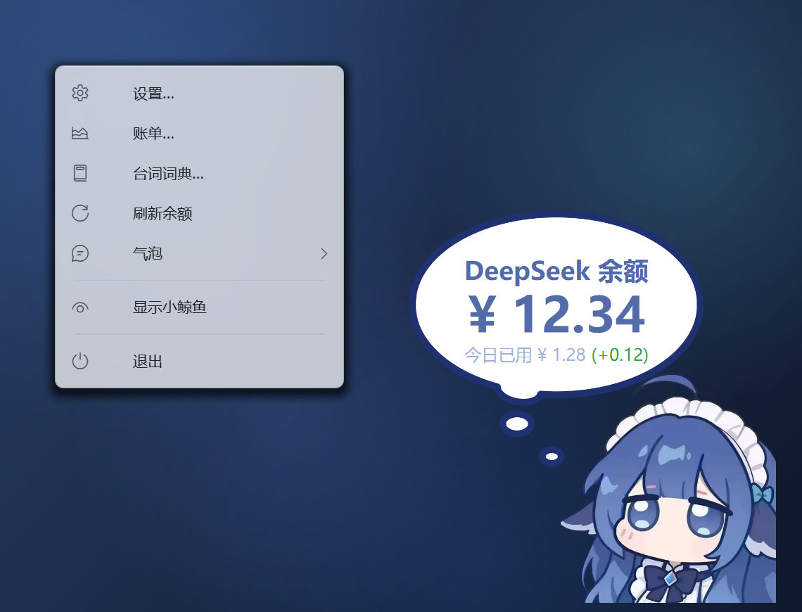
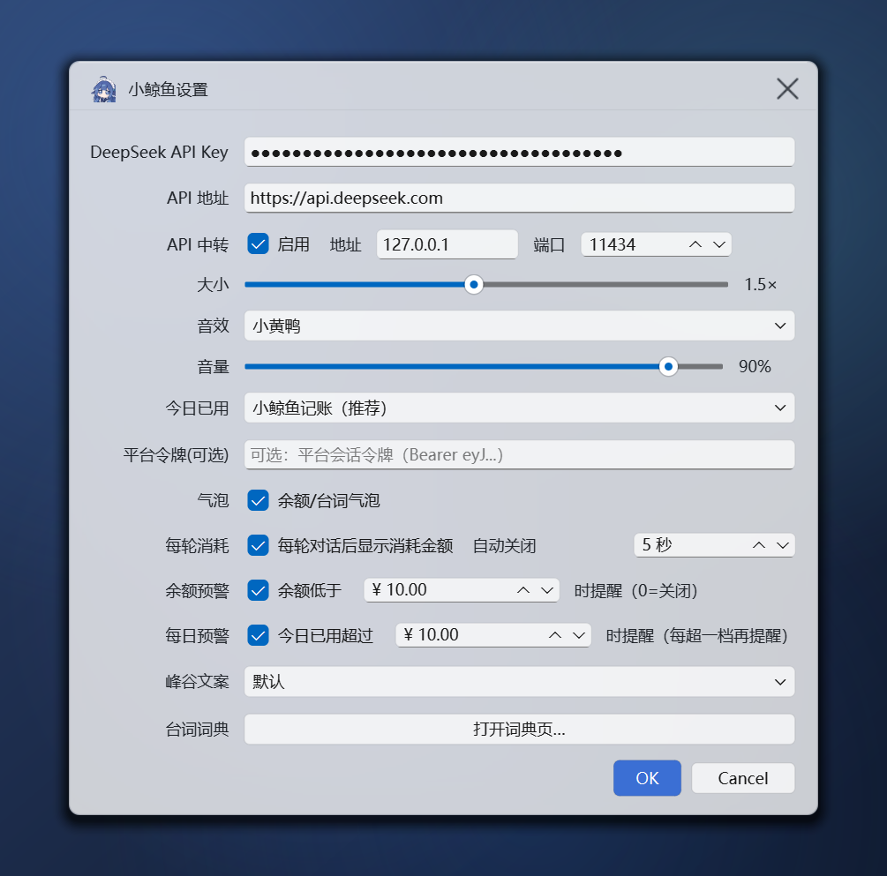
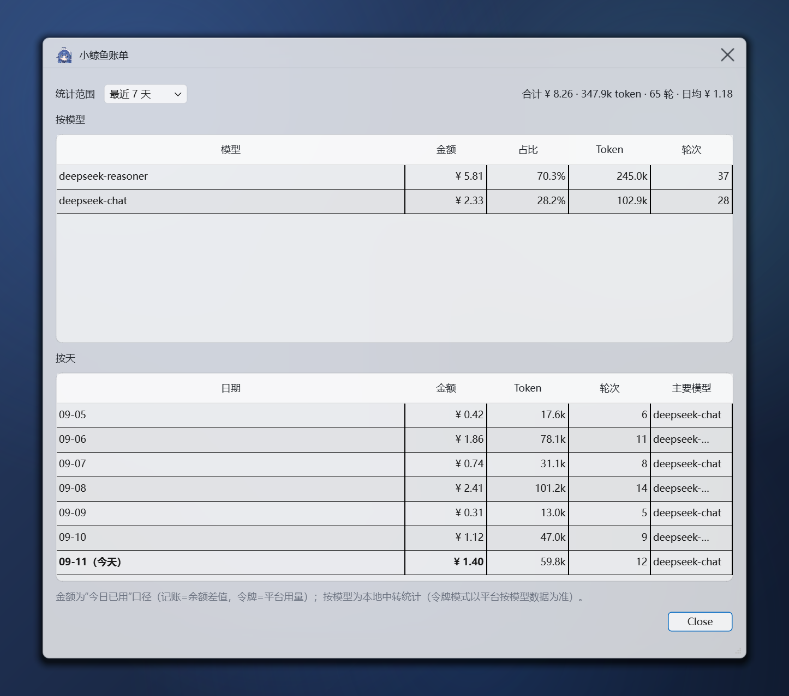
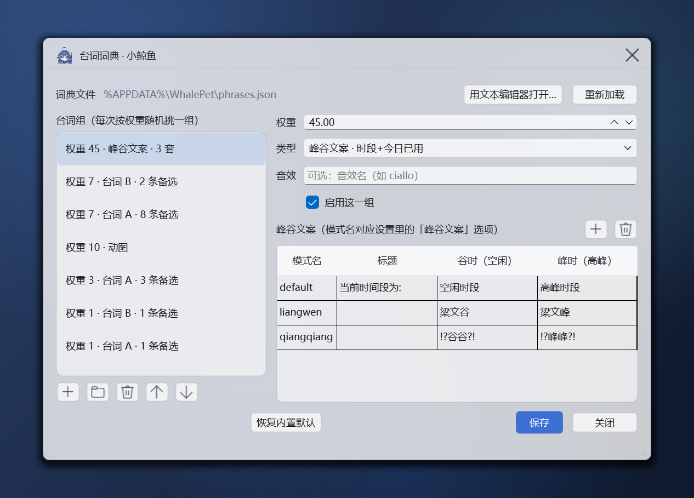

# 🐳 DeepSeek 小鲸鱼桌宠

透明置顶的桌面宠物：**实时余额**、**今日已用**、**每轮对话消耗**，外加可自定义的台词气泡、
账单统计与余额预警。独立运行，不需要浏览器，也不需要 DSH。



> **下载**：到 [Releases](https://github.com/dorioku/DeepSeek-Whale-Pet/releases) 拿 `WhalePet.exe`
> （单文件，约 53 MB，双击即用）。

## 功能

- 💰 **余额 / 今日已用** —— 点一下小鲸鱼弹出气泡，显示余额、今日消耗和偏离值；余额变化时数字滚动。
- 🧾 **每轮对话消耗** —— 内置 OpenAI 兼容 **API 中转**，把客户端请求转发给 DeepSeek，
  按峰谷定价把 usage 换算成金额；快速连轮显示「连续 N 轮对话消耗」的累计值。
- 🎭 **台词词典** —— 随机台词、峰谷文案、音效都在一个可编辑的 `phrases.json` 里，
  自带**词典编辑页**（改权重 / 样式 / 换行 / 音效，保存即生效，不用重启）。
- 📊 **账单统计** —— 今天 / 7 / 30 / 90 天，按天 + 按模型（金额 / 占比 / Token / 轮次），
  历史保留 **730 天**。
- 🔔 **预警** —— 余额低于阈值、今日已用超过阈值时弹气泡 + 托盘通知（阈值可在设置里改）。
- 🪟 **界面** —— 菜单与页面统一 Win11 风格：圆角 + 亚克力磨砂，老系统自动降级为半透明卡片。


## 快速开始

**① 下载 exe（推荐）**：[Releases](https://github.com/dorioku/DeepSeek-Whale-Pet/releases) →
`WhalePet.exe`，双击运行。

**② 从源码运行**：

```powershell
pip install -r requirements.txt
python main.py
```

首次启动会弹出设置窗口，填入 **DeepSeek API Key**（拉余额 + 中转转发）后缓存到本地，之后不再询问。

**③ 自己打包 / 发布**：

```powershell
python release.py         # 只打包 → dist\WhalePet.exe
python release.py 0.3     # 打包 + 提交 + 打标签 v0.3 + 推送 + 发布 GitHub Release
python release.py 0.3 -y  # 同上，跳过发布前二次确认
```

打包与发布都由 `release.py` 一个脚本完成（依赖 PyInstaller，发布还需要装好并登录
[GitHub CLI](https://cli.github.com/)）；打包参数只在 `WhalePet.spec` 里改。

## 界面预览

**右键 / 托盘菜单** —— 设置、账单、台词词典、刷新余额、气泡二级菜单：



**设置** —— API Key / 中转、大小、音效音量、记账模式、余额与每日预警阈值：



**账单** —— 按模型汇总 + 按天明细（可拉伸窗口，金额均按「今日已用」口径）：



**台词词典编辑页** —— 左边选台词组，右边改属性与每一条台词，保存即生效：



> 这些图由 `tools/gen_screenshots.py` 用真实的绘制代码离屏渲染生成，改完界面可以重跑刷新。

## 用法

- **点一下小鲸鱼**：没有气泡时 → 弹余额气泡并手动刷新；气泡还在时 → 换一条台词并把停留重置为 5 秒
  （连点就一直换台词，点不没；**最近两条出现过的那条不会马上重复**）。
- **点击后 1 秒保护期**：刚点完台词时若撞上轮询 / 轮计费，气泡内容会**排队延后 1 秒**再切换
  （金额、账本等数据照常立刻更新），先让你把点出来的那句看完。
- **拖拽**：按住拖动，松手吸附到最近的四分之一边缘（四边 + 四角）；吸到左缘时整体水平镜像，
  文字仍然可读。
- **按压**：按下有小 Q 弹 + 音效（小黄鸭 / 音效1，可在设置里切换、调音量）。
- **自动轮询**：基础 60 秒静默刷新；既没有走中转调用、余额也和上次一样，间隔就翻倍降速
  （60s → 120s → 240s … 上限 30 分钟）；一旦有中转调用或余额变化，立刻回到 60 秒。
- **气泡续时**：气泡在场时，轮询或轮计费凑过来只会**重新计时**（普通 / 计费 5 秒、预警 8 秒），
  不会把内容换成别的，也不会重播生成动画。
- **右键菜单 / 托盘**：设置、账单、台词词典、刷新余额、「气泡」（换一条台词 / 收起气泡 /
  启用台词气泡）、显示隐藏小鲸鱼、退出。同一时间只允许一个实例
  （确需多开设环境变量 `WHALE_PET_ALLOW_MULTI=1`）。

## 统计每轮消耗（API 中转）

把任何 OpenAI 兼容客户端的 `base_url` 指过来即可：

```python
from openai import OpenAI
client = OpenAI(api_key="<任意值>", base_url="http://127.0.0.1:11434/v1")
resp = client.chat.completions.create(model="deepseek-chat", messages=[...])
```

中转会把请求转发到配置里的 `api_base`（默认 `https://api.deepseek.com`），从响应的 usage
按**峰谷定价**（工作日高峰 9:00–12:00 / 14:00–18:00；2026-08-23 起周末全天谷价）换算出成本，
小鲸鱼随即弹出「上一轮对话消耗 ¥X.XX」。流式请求（`stream=True`）同样支持。
`GET /v1/models`、`GET /healthz` 可用于联通性检查。

## 自定义台词词典

随机台词不是写死在代码里的，而是放在与 `config.json` 同目录的 `phrases.json`
（首次运行自动生成一份与内置台词相同的默认词典，文件里的 `"_说明"` 写了完整格式）。

打开方式：右键小鲸鱼 / 托盘 →「台词词典…」，或设置 →「台词词典 → 打开词典页…」。
页面里也留了「用文本编辑器打开…」给习惯直接改 JSON 的人，写坏了还能一键「恢复内置默认」。
保存后桌宠按文件指纹自动重载，**立即生效**。

```json
{
  "groups": [
    { "weight": 45, "type": "peak",
      "texts": { "default": { "off": "空闲时段", "peak": "高峰时段" } } },
    { "weight": 7, "style": "B", "lines": ["好模型... ↓", "好女孩...↓"] },
    { "weight": 7, "style": "A", "wrap": true, "lines": [
        ["第一行大字，长句自动换行", { "text": "第二行小字", "style": "C" }],
        "或者就一句话" ] },
    { "weight": 10, "type": "gif" },
    { "weight": 1, "sfx": "ciallo", "lines": [
        [ { "text": "Ciallo～", "style": "B" }, { "text": "(∠・ω< )⌒☆", "style": "C" } ] ] }
  ]
}
```

- **`groups`**：每次弹台词先按 `weight`（权重，默认 1）随机挑一组，再从该组的备选里随机挑一条；
  `"enabled": false` 整组停用，`weight <= 0` 或格式不对的组直接忽略。
- **一条备选**：可以写成 `"文本"`、`{ "text": "...", "style": "B" }`，或一个列表
  （= 一次显示多行的成套台词，如内置峰谷组）。
- **样式**：`A` 普通台词 / `B` 大字台词 / `P` 强调大字（默认按峰谷红绿，可用 `color` 指定色值）/
  `C` 小字提示。
- **`sfx`**：显示这组 / 这条台词时播放同名音效（自带淡入淡出）。查找顺序是
  `sounds/`（与 `config.json` 同目录）→ 内置 `assets/`，同目录按
  `wav → mp3 → aac → m4a → ogg → flac` 取第一个。运行中替换 / 删除音频文件即时生效。
  想换成自己的音频（如柚子社的 Ciallo 配音，请自行确认使用授权）直接放 `sounds\ciallo.mp3` 即可，
  不用重新打包。
- **`type: "peak"`** 是内置动态组（当前时段 + 今日已用）：`texts` 的键对应设置里的「峰谷文案」，
  也可以自己加（如 `"moyu": { "off": "摸鱼谷", "peak": "摸鱼峰" }`，再把 `config.json` 的
  `peak_mode` 填成 `moyu`）；`type: "gif"` 是表情动图组，不带文字。
- 写坏也没关系：文件读不出来时自动退回内置默认台词（打开词典页会提示原因）；
  想恢复出厂设置，删掉文件即可重新生成。

## 文件位置

| 文件 | 位置 | 说明 |
|---|---|---|
| `config.json` | `%APPDATA%\WhalePet\` | API Key、大小音效、记账模式、预警阈值；便携模式 = exe 同目录 |
| `ledger.json` | 同上 | 账本：今日已用 + 每日 / 按模型历史（保留 730 天） |
| `phrases.json` | 同上 | 台词词典（可自由编辑，删掉会重新生成） |
| `sounds/` | 同上 | 自备音效，优先级高于内置 `assets/` |

源码运行与打包版**共用同一份**，启动即读缓存，不依赖网络。也可以用环境变量
`WHALE_PET_CONFIG_PATH` / `WHALE_PET_LEDGER_PATH` / `WHALE_PET_PHRASES_PATH` /
`WHALE_PET_SOUNDS_PATH` 指定到别处。

## 目录结构

```text
Whale-Pet/
├── main.py                     # 入口（单实例锁 + 首次配置引导 + 启动中转服务）
├── release.py                  # 一键构建 / 发布（PyInstaller + GitHub Release）
├── WhalePet.spec               # PyInstaller 打包配置（改打包参数改这里）
├── requirements.txt            # PySide6 + requests
├── pet/
│   ├── config.py               # 配置读写（路径解析 / 便携模式）
│   ├── balance.py              # 余额拉取 + 本地记账账本 + 平台令牌用量
│   ├── pricing.py              # 峰谷定价（移植自原插件 lib/index.js）
│   ├── proxy.py                # API 中转（/v1/chat/completions 转发 + usage 统计）
│   ├── phrases.py              # 台词词典（读写 + 加权抽取 + 热重载）
│   ├── whale_widget.py         # 桌宠窗口（气泡 / 拖拽吸附 / 按压音效 / 预警）
│   └── ui/
│       ├── theme.py            # Win11 玻璃窗口基类（亚克力 + 自绘卡片 / 标题栏）
│       ├── icons.py            # Segoe Fluent 图标
│       ├── menu.py             # 自绘菜单（圆角 + 毛玻璃 + 二级菜单）
│       ├── settings_dialog.py  # 设置
│       ├── stats_dialog.py     # 账单
│       ├── phrases_dialog.py   # 台词词典编辑页
│       └── phrases_model.py    # 词典文件模型（原子写 + 保真读改）
├── tools/
│   ├── gen_ciallo_sfx.py       # 生成内置占位音效
│   └── gen_screenshots.py      # 生成上面那些界面截图
├── assets/                     # 鲸鱼图 / 动图 / 音效
└── docs/screenshots/           # README 用的截图
```

## 说明

- **「今日已用」怎么算**（记账模式，默认）：每天首次观测时缓存当日**资金初始值**，用观测到的余额下降
  累计；账本持久化，重启后拿上次观测值和当前余额作差，**程序关闭期间的消耗也能补上**。
  每轮对话消耗走中转统计，**立刻叠加**到今日已用（不等轮询）。
- **偏离值**：轮询同步后用 `(+0.12)` / `(-0.04)` 标出**当前轮**的偏离 =
  （上次同步后新增的实测消耗 − 新增的每轮预估），正负分别显示绿 / 红，**不整天累计**
  （下次同步重新起算；没统计到任何一轮时不显示）。
- **令牌模式**：在设置里填入 DeepSeek 平台会话令牌（`Bearer eyJ...`）后切过去，
  直接调平台用量接口拿到精确值，按模型数据也以平台为准（与本地统计同一套「基准 + 增量」口径）。
- **长期记账 / 多开**：账本按天归档（含每个模型的金额 / Token / 轮次），保留 730 天；
  写入用原子替换，每次轮询都对比文件并合并外部改动，旧位置的账本首次启动会自动并入历史，
  所以多开或重启不会再把数据清零（默认也还是单实例运行）。
- **预警**：`alert_balance`（余额低于）/ `alert_daily`（今日已用超过）两个阈值，
  0 或关闭开关即不提醒；每日预警每超过一档（如 2×、3× 阈值）会再提醒一次，重启不重复。
- **定价常量**在 `pet/pricing.py`，DeepSeek 调价时可直接改。

## 与原项目的关系

本项目的**创意来源**、**美术音效素材**与**部分算法**来自开源项目
[DeepSeek-Balance-Whale-Widget](https://github.com/MeteorNOX/DeepSeek-Balance-Whale-Widget)
（DSH 小鲸鱼余额挂件，作者 [MeteorNOX](https://github.com/MeteorNOX)，MIT License），
这里是它的独立桌面版重实现：

| | DSH 插件版（原项目） | 本独立版 |
|---|---|---|
| 运行环境 | 浏览器里的 DSH Web 界面 | 独立 exe / Python 进程 |
| 余额来源 | DSH 宿主的凭据服务 | 自己填 DeepSeek API Key |
| 每轮对话消耗 | 监听 DSH 会话事件 | **内置 API 中转**统计 usage |
| 配置位置 | `~/.dsh/` | `%APPDATA%\WhalePet\`（便携 = exe 同目录） |

具体复用了：

- 🖼️ **美术与音效**：`assets/` 里的小鲸鱼（`DSniang1.png` / `DSniang02.png`）、动图 `rua.gif`、
  音效（`Ya1` / `Ya2` 小黄鸭、`D1` / `D2` 音效1）均取自原项目，未重新绘制。
- 💰 **峰谷定价**：`pet/pricing.py` 移植自原项目 `lib/index.js`（时段、周末谷价、各模型单价表一致）。
- 📐 **气泡视觉参数**：气泡几何（viewBox 1026×700）、文字块中心比例、换行宽度等排版常量同样参照
  `lib/index.js`，以保持与原版一致的观感。
- 🧸 **交互设计**：点击切换气泡内容、四分之一边缘吸附、左吸附水平镜像、按压 Q 弹、随机台词与
  gif 动图等玩法沿用原项目的设计。

也感谢 [DeepSeek](https://www.deepseek.com/) 提供 API 与平台用量接口，
[Qt / PySide6](https://doc.qt.io/qtforpython/) 提供 GUI 框架，以及原项目的所有贡献者。

### 许可说明

原项目采用 **MIT License**（Copyright © 2026 MeteorNOX）。本项目包含其代码移植与素材，
因此同样遵循 MIT 许可条款并保留原始版权声明；再分发时请一并保留上述致谢与许可信息。
本项目自身的许可见 [LICENSE](LICENSE)。
